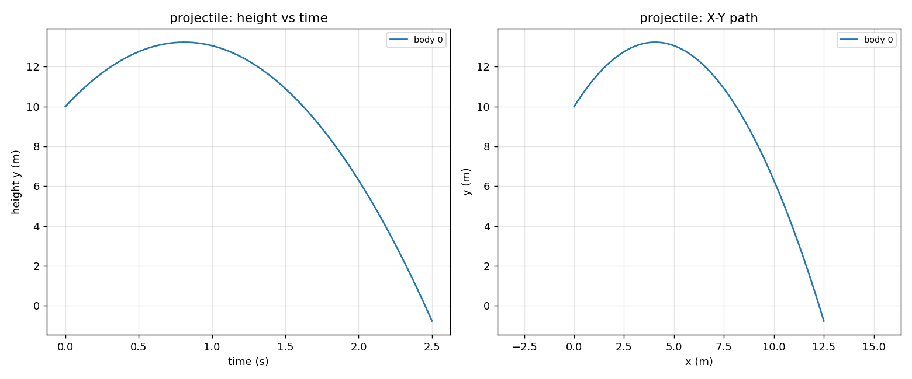
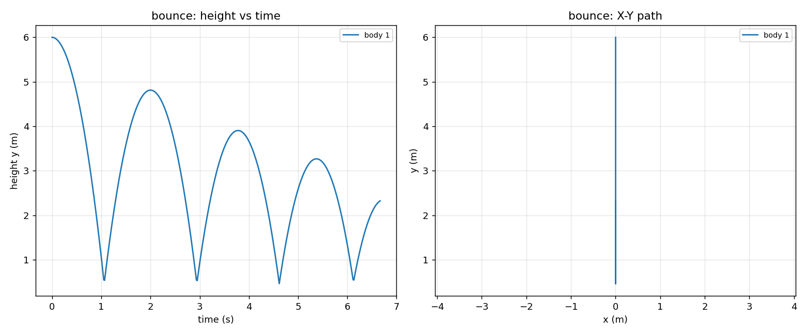
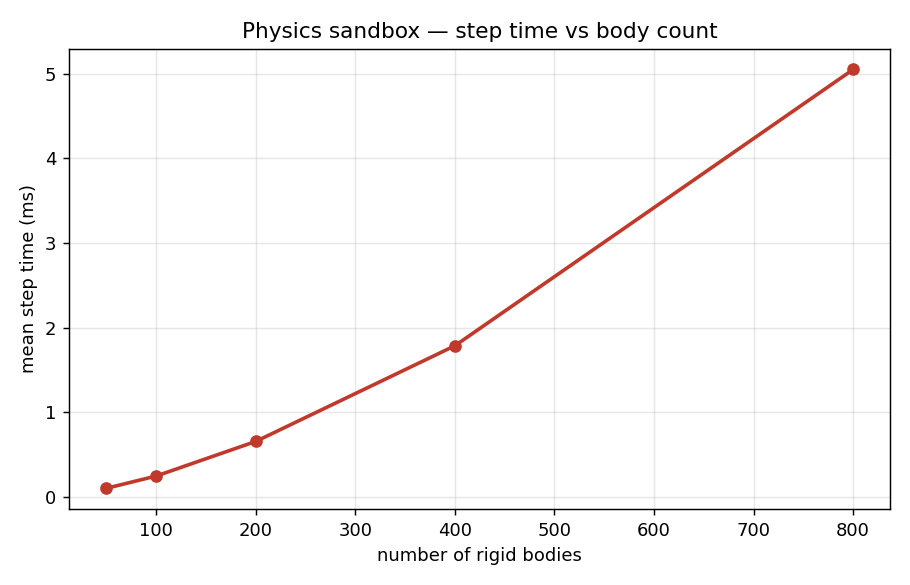

# 3D Rigid-Body Physics Sandbox (Bullet, C++)

[](https://github.com/mahirc24/3D-Physics-Sandbox/actions/workflows/ci.yml)

A modular 3D rigid-body physics sandbox built on the **Bullet Physics Engine
(C++)**, with collision detection, gravity, friction, restitution, joint and
contact constraints, ray casting, live debug/visualization utilities, and a
Python harness that automates simulation testing and performance analysis.

Every capability is exercised by a runnable scenario and checked against expected
physical behavior. The whole thing builds with CMake and runs headless, so it
works on a server or CI as well as a workstation.

---

## Results

All plots below are generated by the Python tooling (`scripts/plot_trajectories.py`,
`scripts/performance_analysis.py`) from actual simulation output.

**Projectile** — the simulated path (center of mass) traces the analytic parabola;
error scales like `0.5·g·h·t` and shrinks with the fixed step.



**Bounce** — a sphere with restitution 0.8 loses ~36% of its height each bounce,
exactly as `e²` predicts.



**Performance** — mean step time vs body count for the `perf` stress scenario.



---

## What it does (and where each piece lives)

| Capability | Implementation |
|---|---|
| Rigid-body world: broad-phase (Dbvt) + narrow-phase dispatcher, gravity, sequential-impulse solver | `src/PhysicsWorld.{h,cpp}` |
| Adjustable time-steps + solver substeps for stable stacked / fast-moving bodies | `PhysicsWorld::step()` (`stepSimulation(dt, subSteps, fixedStep)`) |
| Modular framework for spawning & configuring objects (box, sphere, capsule, cylinder, plane) with mass, friction, restitution, damping, CCD | `src/RigidBodyFactory.{h,cpp}`, `BodyDesc` in `src/Common.h` |
| Joint constraints: point-to-point, hinge, fixed, slider (contact constraints handled by the solver) | `PhysicsWorld::addPoint2Point / addHinge / addFixed / addSlider` |
| Ray casting for object picking and line-of-sight queries | `src/RayCaster.{h,cpp}` |
| Debug/visualization: collision wireframe, contact points, constraint frames, AABBs | `src/DebugDrawer.{h,cpp}` |
| Trajectory + velocity logging for analysis | `src/TrajectoryLogger.{h,cpp}` |
| Energy / contact / timing metrics | `src/Metrics.{h,cpp}` |
| Demo scenarios exercising the full feature set | `src/Scenarios.{h,cpp}` |
| Python: automated regression testing vs expected physics | `scripts/run_tests.py` |
| Python: analytic validation + integrator convergence study | `scripts/validate_physics.py` |
| Python: performance analysis / benchmarking | `scripts/performance_analysis.py` |
| Python: trajectory plotting | `scripts/plot_trajectories.py` |

---

## Build

Requires a C++17 compiler, CMake ≥ 3.16, and the Bullet development libraries.

```bash
# Ubuntu / Debian
sudo apt-get install build-essential cmake libbullet-dev

# macOS (Homebrew)
brew install cmake bullet

./build.sh
# or manually:
#   mkdir build && cd build && cmake .. -DCMAKE_BUILD_TYPE=Release && cmake --build . -j
```

This produces `build/sandbox` (the CLI driver) and `build/sandbox_tests` (native
tests). CMake finds Bullet via `find_package(Bullet)` and falls back to
`pkg-config`. The single-precision libraries are used, so
`BT_USE_DOUBLE_PRECISION` is intentionally **not** defined.

---

## Run

```bash
./build/sandbox --list                 # list scenarios
./build/sandbox --scenario stack        # run one, print a summary
./build/sandbox --scenario bounce --steps 400 \
    --out traj.csv --metrics metrics.json --debug geom.txt
```

### Scenarios

| Name | What it demonstrates |
|---|---|
| `stack` | A tower of boxes — solver stability under stacking |
| `bounce` | A dropped sphere — restitution / bounce height |
| `projectile` | Ballistic motion vs the analytic parabola |
| `pendulum` | A point-to-point joint — energy conservation |
| `friction_ramp` | A box on an incline — static vs kinetic friction |
| `domino` | A domino chain — collision-driven cascade |
| `ccd` | A fast sphere vs a thin wall — continuous collision detection |
| `raycast` | Object picking + line-of-sight queries |
| `perf` | Many falling bodies — performance benchmark |

### Options

```
--scenario NAME     scenario to run (default: stack)
--steps N           number of simulation steps (default: 300)
--timestep DT       simulated seconds advanced per step (default: 1/60)
--fixedstep FS      internal fixed integration step (default: 1/120)
--substeps K        max solver substeps per step (default: 10)
--gravity G         gravity magnitude, applied as -Y (default: 9.81)
--count N           scenario body/stack count
--drop H            drop / launch height
--angle D           ramp angle (degrees)
--friction F        object friction
--no-ccd            disable continuous collision detection (ccd scene)
--seed S            RNG seed
--out FILE          write trajectory CSV
--metrics FILE      write metrics JSON
--debug FILE        capture + write debug geometry
--quiet             suppress the summary line
```

**Timestep note.** `step()` advances `timestep` seconds by running internal fixed
steps of `fixedstep`, up to `substeps` of them. Keep `timestep ≤ substeps ×
fixedstep` or Bullet drops simulation time. A smaller `fixedstep` improves
tunnelling and stacking behavior; Bullet's discrete restitution is most accurate
near 1/60–1/120, which is why that's the default.

---

## Python tooling

The scripts auto-locate `build/sandbox` (override with `--binary` or the
`SANDBOX_BIN` env var). `run_tests.py` and `validate_physics.py` use only the
standard library; plotting needs `matplotlib` (`pip install -r
scripts/requirements.txt`).

```bash
python3 scripts/run_tests.py                      # regression harness (pass/fail)
python3 scripts/validate_physics.py               # analytic validation report
python3 scripts/performance_analysis.py --plot perf.png
python3 scripts/plot_trajectories.py --scenario bounce --out bounce.png
```

`run_tests.py` runs every scenario and benchmarks the outputs against expected
physical behavior — resting heights, bounce height from restitution, the analytic
parabola, joint length, friction thresholds, the domino cascade, CCD stopping vs
tunnelling, and ray-query results — exiting non-zero on any failure.

---

## Native tests

```bash
./build/sandbox_tests      # or: cd build && ctest --output-on-failure
```

Direct assertions on the engine API: resting height = radius, free fall vs
`½gt²`, restitution bounce height, ray picking and line-of-sight, joint length
preservation, stack stability, and CCD (stopped with CCD, tunnels without).

---

## Architecture

```
BodyDesc ──► RigidBodyFactory ──► BodyRecord ──► PhysicsWorld ──► step()
   (config)      (create)          (owns          (simulate)
                                    shape+body)
                                        │
        RayCaster ◄─────────────────────┤ (picking, line-of-sight)
        DebugDrawer ◄───────────────────┤ (wireframe, contacts, constraints)
        TrajectoryLogger ◄──────────────┤ (per-step state → CSV)
        Metrics ◄───────────────────────┘ (energy, contacts, timing → JSON)
```

`sandbox_core` is a static library (the engine); `sandbox` and `sandbox_tests`
link against it. Scenarios build scenes purely through the public API, so adding
one is a single function that fills in `BodyDesc` structs and wires constraints.

## Extending

- **New shape**: add a `ShapeType` and a case in `RigidBodyFactory::createShape`.
- **New scenario**: add a builder in `Scenarios.cpp` and register it in
  `buildScenario` / `listScenarios`.
- **Interactive rendering**: `DebugDrawer` implements `btIDebugDraw`; point its
  `drawLine` at an OpenGL line renderer (e.g. GLFW) to get a real-time window.
  Headless, it serializes the same geometry for offline plotting.

## Continuous integration & Docker

`.github/workflows/ci.yml` builds the project and runs both the native tests and
the Python harness on every push (Ubuntu, Bullet from apt). Replace `mahirc24/3D-Physics-Sandbox`
in the badge above with your GitHub path.

For a reproducible run anywhere:

```bash
docker build -t physics-sandbox .
docker run --rm physics-sandbox                                   # test harness
docker run --rm physics-sandbox ./build/sandbox --scenario bounce --steps 400
```

## Notes on physical accuracy

Bullet uses a semi-implicit Euler integrator with a sequential-impulse solver, so
results are close to analytic but not exact: trajectory error scales like
`0.5·g·h·t` and halves as the fixed step halves (see
`validate_physics.py`), and joints are compliant (stiffer with more solver
iterations). These are properties of real-time rigid-body simulation, and the
tests assert against physically appropriate tolerances rather than pretending the
solver is exact.


./build/sandbox --list
./build/sandbox --scenario projectile --steps 200
./build/sandbox --scenario ccd --steps 200
./build/sandbox --scenario ccd --steps 200 --no-ccd
./build/sandbox_tests
python3 scripts/run_tests.py
